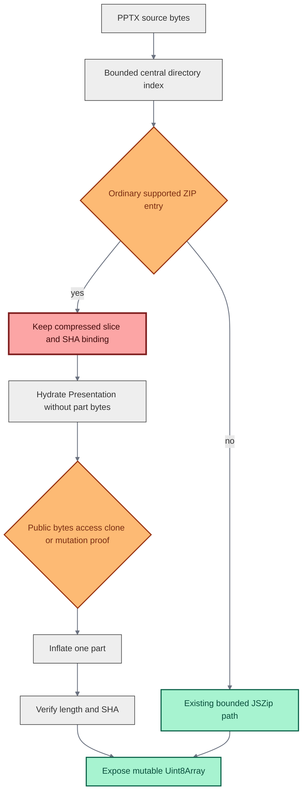

# OfficeKit PPTX 性能与内存优化复盘

> .NET WASM、NativeAOT、内存治理与按需加载的实测记录

状态日期：2026-08-28

本文记录 OfficeKit PPTX codec 从 .NET WASM 迁移到 C# NativeAOT，以及后续的性能和内存优化。不同脚本的结果分开列出，避免混用测试口径。

状态分为：

- 已经进入远端 `main` 的实现；
- 在隔离分支完成、尚未合入 `main` 的实现；
- 只做过实验并已经撤销的候选；
- 有工程观察但没有冻结计时的环节。

## 1. TL;DR

OfficeKit 保留 Node 中的 JavaScript 对象模型、`.mjs`、REPL 和 `ctx.state`。底层沿用现有 C# codec，运行方式从进程内 .NET WASM 改为经过完整性校验的 NativeAOT 子进程。

最初冻结的 7,330,920 字节、24 页 PPTX 基准中：

| 路径 | 耗时 | 峰值 RSS |
|---|---:|---:|
| .NET WASM 单次 import | 21.4 s | 301.2 MB |
| .NET WASM import + no-op export | 39.0 s | 387.6 MB |
| 同一 C# codec 的 NativeAOT 探针 | 0.81 s 完整进程 | 158 MB |
| NativeAOT 正式迁移完成 | 1.31 s 冷端到端 | 250.6 MiB |
| 当前受控 CLI 路径 | 493–759 ms import | 179.7–190.8 MB |

“400–500 MB”来自三个测试口径：WASM 往返链路峰值为 387.6 MB，完整加载采样为 439 MiB，四路完整模型并发为 457 MiB。旧版渲染没有独立、可复查的计时。

`Professional Minimalist` 压力样本的同口径 A/B 结果：

| 指标 | 优化前 | 优化后 | 变化 |
|---|---:|---:|---:|
| 进程树峰值 RSS 中位数 | 241.3 MiB | 191.9 MiB | -49.4 MiB，-20.5% |
| import 中位数 | 399.9 ms | 302.1 ms | -24.4% |
| 采样 CPU | 560 ms | 390 ms | 约 -30.4% |
| Node external memory | 约 74.7 MB | 约 50.8 MB | 约 -23.9 MB |

四次专用入口 import 的峰值均为 190.6–195.2 MiB。该优化位于 `c231f998`，尚未合入远端 `main`。

200 MiB 指标目前只覆盖专用入口的单次 import。7.33 MB 基准文件的 no-op import + export 峰值中位数为 200.2 MiB，真实编辑并二次导入为 212.6 MiB；24.1 MB 压力文件的完整 native graph 加载为 229.8–235.9 MiB，真实编辑往返链路为 269.3–273.0 MiB。

## 2. 起点：WASM codec 是主要瓶颈

初次对比中，Kimi 的 PPTX 转换约为 0.5–1 秒，OfficeKit 则耗时更长且占用更多内存。当时误以为差距来自 Rust 小程序与 JavaScript 运行时。

二进制检查发现，`kimi-slides 2.2.8` 是带完整 Go runtime 的 macOS arm64 Mach-O，约 26 MiB。OfficeKit 的实际调用链为：

```text
Node public API
  -> JavaScript object model
  -> protobuf request
  -> .NET 8 browser WASM and WebCIL
  -> C# Open XML SDK codec
  -> protobuf response
  -> JavaScript hydration
```

同一份 7.33 MB、24 页 PPTX 的第一轮测量为：

| 路径 | 耗时 | 峰值 RSS |
|---|---:|---:|
| Kimi 派生引擎：PPTX → PPTD | 1.03 s | 53.1 MB |
| Kimi 派生引擎：PPTD → PPTX | 0.50 s | 52.2 MB |
| OfficeKit：仅 import | 21.4 s | 301.2 MB |
| OfficeKit：import + no-op export | 39.0 s | 387.6 MB |

OfficeKit 单次 import 在不同轮次耗时 11–21 秒。细分计时为：

- JavaScript 对象 hydration 约 0.3–0.6 秒；
- WASM 启动约 0.13 秒；
- `.NET/WASM codec invoke` 占 25.6/27.2 秒，超过当时一次细分调用的 94%；
- 加载 .NET WASM 使 RSS 增加约 114 MB；
- 7.33 MB 输入形成同量级 protobuf 请求，响应又达到约 12.98 MB；
- 请求和响应内部同时存在源包、protobuf frame、C# 数组和 JS byte view；
- `PackageGuards` 与 Open XML SDK 会在不同阶段读取、解压和验证同一 ZIP。

WebCIL/WASM codec 消耗了主要时间；运行时和多份完整对象图重叠构成内存峰值。

## 3. Kimi 对比的适用范围

Kimi 数据用于性能参考；OfficeKit 保真通过字节一致性、包结构保留和真实编辑回环验证。

同一输入经过 Kimi 派生引擎回写后，包结构发生了明显收缩：

| 包结构 | 输入 / OfficeKit no-op | Kimi 回写 |
|---|---:|---:|
| package parts | 142 | 68 |
| layouts | 10 | 1 |
| notes 相关 parts | 34 | 0 |
| media | 4 | 2 |
| relationship parts | 57 | 28 |

OfficeKit no-op export 的输出与输入逐字节一致。Kimi 将 PPTX 归一化成更窄的页面表示，再据此重建文件，处理的 package parts 更少。OfficeKit 的保真范围还包括母版、布局、notes、媒体和关系拓扑。

OfficeKit 继续保留完整保真能力，优化只删除对相同字节、ZIP part、语义投影和验证结果的重复处理。

原始 Kimi 可执行文件受当前宿主的启动门限制，退出码为 0，但不产生目标文件。表中数据来自仓库内移除该启动门的派生引擎。

## 4. REPL 与 codec 独立选型

当时考虑过四个方向：继续优化 C# WASM、C# NativeAOT、Go native 和 Go REPL。

REPL 在同一 Node 进程中执行异步 JavaScript cell，`ctx.state` 和 OfficeKit 对象可跨 cell 保存。C# codec 处理 DOCX、XLSX、PPTX 与 protobuf 之间的转换，生命周期独立于 REPL。

职责划分如下：

| 责任 | 保留的实现 |
|---|---|
| REPL、`.mjs`、对象编辑、Compose | JavaScript / Node |
| DOCX、XLSX、PPTX package codec | C# / Open XML SDK |
| 进程边界 | protobuf + framed stdio |
| PDF | 独立于 Office codec |

Go 可以实现命令循环或解释器，但 Go REPL 需要重新实现 Node ESM、动态 import、异步调用和现有对象模型。用 Go 重写 native codec 还需替换当时约 4.2 万行 C# 实现和约 3 万行测试，风险集中在 master/layout、notes/comments、charts、OLE、opaque OPC 和 source-bound edit。

同一份 C# 源码在三种运行方式下的结果：

| 后端 | Import codec | 完整进程 | 峰值 RSS | 输出 |
|---|---:|---:|---:|---|
| .NET WASM / WebCIL | 约 21–26 s | 约 22–28 s | 约 300 MB | 基准 |
| C# CoreCLR | 0.92 s | 1.05 s | 195 MB | 响应相同 |
| C# NativeAOT | 0.20 s | 0.81 s | 158 MB | 响应逐字节相同 |

NativeAOT 在保留 codec 实现的条件下消除了绝大多数 WASM CPU 时间。

## 5. 迁移到单一 NativeAOT codec

Office codec 运行在本地子进程中。单一 NativeAOT 后端减少了运行时打包、故障诊断、后端一致性验证以及安装与 SBOM 范围。

Office 文件统一使用一个 NativeAOT codec：


`OfficeKit.NativeHost` 直接引用原 `OfficeKit.Codec`。Node 校验完整性后按需启动子进程，供 REPL、`.mjs` 和六个 Office facade 复用。stdout 只传协议帧，stderr 有界收集；协议错误、截断、超限、checksum 失败或进程退出时 fail closed，带副作用的请求由调用方显式重试。

平台包使用 exact-version optional dependency，并只通过绝对路径启动经过校验的二进制。macOS arm64、Linux x64、Windows x64 各携带一份 native executable。迁移后删除 `runtime/office-kit` 和旧 `OfficeKit.Runtime` WASM host。

正式迁移后的 7.33 MB、24 页结果：

- 冷端到端：1.31 秒；
- import 内部：1.03 秒；
- Node 与 codec 进程树峰值：250.6 MiB；
- Node 约 184 MiB；
- codec 约 66 MiB。

冷端到端耗时低于 1.5 秒，进程树峰值仍高于 200 MiB。

## 6. NativeAOT 之后的对象加载高水位

正式迁移完成后，更细的阶段化 profile 捕获到一次 439 MiB 峰值：

- 冷导入约 1.46 秒；
- 进程树峰值 439 MiB；
- import 后强制 GC，Node 仍约 301 MiB；
- JS heap 约 97 MiB；
- external / ArrayBuffer 约 49 / 42 MiB。

两个脚本的对象持有阶段和采样窗口不同。439 MiB 的 profile 覆盖了完整 response、source package、native graph、公共 JS 对象和内部 mutation snapshot 同时存在的窗口；250.6 MiB 来自较早结束的迁移验收窗口。

NativeAOT 消除了 WASM 解释执行时间，但对象所有权和 hydration 算法仍会产生 400 MB 级峰值。

第一轮 post-migration 优化 `61f8dd76` 做了以下工作：

- protobuf、FileBlob、ByteString 的重复复制；
- ZIP part 的流式 hash；
- 共享只读媒体和 native part；
- 缓存图片 data URL；
- mutation snapshot 只生成一次；
- 大图片快照使用长度和 SHA 身份；
- native leaf / component 编辑索引延迟创建。

同一阶段的结果：

| 指标 | 之前 | 之后 |
|---|---:|---:|
| 冷 import 中位数 | 1.15 s | 0.81 s |
| Node retained heap | 约 90 MiB | 约 23 MiB |
| 进程树峰值 | 约 410 MiB | 249–299 MiB |

高峰主要来自短命对象、重复 snapshot 和重复 byte ownership，并非固定的 V8 基线成本。

## 7. 优化方法

候选改动按以下规则验收：

1. 使用同一基准文件和当前二进制建立基线；
2. 一次只改变一个所有权或算法候选；
3. 同时记录 import 时间、完整进程树 RSS、codec RSS、响应 bytes/SHA；
4. 跑真实 import → edit → export → reimport；
5. 保留 fail-closed 负例；
6. 延迟或 CPU 回退的候选即使更省内存也撤销；
7. Kimi 输出只作性能参考，OfficeKit 保真由自身证据验收；
8. 性能候选只运行相关的定向检查。

候选通过同口径 A/B 和真实编辑回环后才予以保留。

## 8. 优化阶段一：JS 常驻对象图和图片数据

改动包括调整 Native GC、复用已解析的 source artifact、提前释放 C# 请求缓冲区、共享 imported asset 与 native graph 字节，以及按需生成图片 data URL。

7.33 MB、24 页基准文件的阶段结果：

- hydration 持有 RSS：约 122 MiB → 104–106 MiB；
- external：27.0 MiB → 15.6 MiB；
- 端到端 5 次中位 import：约 0.921 秒；
- Node 稳态 RSS：约 113.9 MiB；
- 进程树峰值：约 230.6 MiB。

公开 `image.dataUrl` 仍然返回相同的 6,830,074 字符；未修改图片继续复用原始资产，用户赋新值仍正常导出。

PPTX-only NativeAOT 原型收益不足，还增加了分发和三格式一致性成本，已撤销。JavaScript 侧保留公开的 `office-kit/presentation` 专用入口，与根入口共用同一 codec 和构造器。

## 9. 优化阶段二：瘦响应与流式传输

### 9.1 瘦响应

PPTX import 的 protobuf response 原来会再次携带完整 `sourcePackage.data`。请求侧已有同一份源文件，JS 在校验 codec 返回的 SHA 后复用经过所有权隔离的请求源副本。

`0f16a028` 的测量结果：

| 指标 | 之前 | 之后 |
|---|---:|---:|
| response bytes | 12,973,659 | 5,642,730 |
| response 变化 |  | -56.5% |
| 进程树峰值中位数 | 253.3 MiB | 242.5 MiB |
| import 中位数 | 978.4 ms | 973.3 ms |

请求源 SHA-256 与 codec 返回值一致时才恢复 source package。response 继续保留 asset bytes 和 opaque graph。

继续移除 asset bytes 的实验使 JS 为恢复数据重新解压整包，进程峰值上升，因此撤销。

### 9.2 NativeHost 流式响应

旧 host 先调用 `ToByteArray()` 构造完整 response，再写 stdout。`0f548916` 改为：

- `CalculateSize()` 写入 4-byte frame length；
- protobuf `WriteTo(Stream)` 直接输出；
- 保留 `CodecProtocol.Invoke(byte[])` 兼容入口；
- Office wire、JS API 和 REPL 保持现有行为。

六次交替 A/B：

| 指标 | buffered | streaming |
|---|---:|---:|
| 进程树峰值中位数 | 256.9 MiB | 254.3 MiB |
| codec 峰值 | 103.1 MiB | 100.5 MiB |
| import | 904.1 ms | 899.3 ms |

瘦响应已经移除最大的 source payload 副本，因此流式输出只再减少约 2.6 MiB，低于预估的 10 MiB。该结果稳定且没有 CPU 回退，予以保留。

## 10. 优化阶段三：旁路文件、进程生命周期和专用入口

private transport 2 将 protobuf 元数据与可选的 raw-file sidecar 分开，减少 PPTX import 和 source-bound edit 对完整源文件的 protobuf 编码、解析和复制。

PPTX import 和 edit source 改为 sidecar 传输，edit scope proof 复用 source/output part maps；同时增加 `office-kit/presentation` 专用入口，并让 Native host 空闲 1 秒后退出。

请求活跃或队列非空时复用 codec；空闲 1 秒后退出，释放约 50 MB RSS。下一次 Office 调用重新执行完整性检查并启动进程。

`office-kit/presentation` 重新导出原有构造器和 facade，`Presentation`、`PresentationFile`、`FileBlob` 与根入口严格同一身份；该入口省去 document、spreadsheet、PDF、Help 和 visual QA 模块。

当时专用入口相对根入口：

- Node 峰值减少约 8.9 MB；
- import 减少约 6 ms；
- 进程树仍约 230–237 MB；
- codec 空闲退出后 Node 常驻约 112 MB。

## 11. 优化阶段四：减少 C# 与 Open XML 重复工作

传输去重后，主要高水位来自 Open XML SDK DOM、媒体解压和语义投影。

### 11.1 package path 复用

OPC safety validation 已经生成完整 package path 集合，native object catalog 又重新打开 ZIP、枚举 entry 并创建相同集合。

`c5895a5d` 合并 16 组交错样本：

- import 694.6 → 684.0 ms；
- 进程树 243.6 → 241.5 MB；
- protobuf response 逐字节一致；
- 编辑 export SHA 与基线一致。

### 11.2 verified media 复用

基准文件中一个 5.1 MB 图片被引用 3 次，一个 1.0 MB 图片被引用 5 次。旧实现会为重复引用多次解压、复制、验证和 hash。

`80763691` 保留第一次完整读取、签名验证、SHA 和 content type 检查，只让相同 SHA 与相同 content type 的后续引用复用已验证 asset。

| 指标 | 之前 | 之后 |
|---|---:|---:|
| import | 783.2 ms | 705.6 ms |
| 进程树峰值 | 244.4 MB | 223.4 MB |
| codec 峰值 | 108.7 MB | 84.6 MB |

### 11.3 删除中间 media array

唯一 media 的首读路径原来是 `MemoryStream → ToArray() → ByteString`。`2fc7dedb` 删除中间 `ToArray()`，但仍让 protobuf 拥有自己的最终 bytes。

- import 702.1 → 690.0 ms；
- 进程树 223.9 → 219.6 MB；
- codec 82.9 → 79.9 MB；
- response 与 edit output SHA 均与基线一致。

### 11.4 释放已经投影的 DOM

`cbc09c28` 在 Open XML SDK 允许重新加载的范围内释放完成投影的 root。前一张 slide 仍保留到下一张 slide 完成 timing/Morph 读取，避免破坏跨页动画语义。

- import 708.8 → 697.4 ms；
- codec peak 80.1 → 78.7 MiB；
- codec idle 63.6 → 59.3 MiB；
- 进程树 226.4 → 225.6 MiB。

response 字节完全一致，性能结果稳定，予以保留。

### 11.5 合并重复分类、投影和删除分析

native / opaque descendant 改为只分类一次；picture、table、chart、connector 和 group 只投影一次；每张 slide 的删除能力只分析一次。

`dad66814` 阶段的汇总快照：

- `office-kit/presentation` 首次 import 约 0.56 秒；
- 进程树峰值约 214.5 MiB；
- codec 退出并 GC 后 Node 约 113.7 MiB；
- 根入口约 0.82 秒 / 242.8 MiB；
- deletion analysis 候选的冷启动 import 快约 6.2%；
- 常驻 codec 快约 7.5%。

## 12. 优化阶段五：OOM 治理

并发和超大输入可能在排队前触发大对象分配。`faca878a` 增加明确的内存边界：

- 默认 Office 输入在复制和 protobuf 编码前检查 64 MiB budget；
- native transport 保留 128 MiB frame 上限；
- 并发调用在编码前进入 FIFO memory lane；
- memory lane 覆盖请求编码、native response、解码和完整 hydration；
- export envelope 获得执行槽后才创建；
- 队列及时释放已完成的 response；
- pipe reader 及时释放已消费 chunk；
- native graph part 顺序解压，避免多个大 part 同时膨胀；
- 可捕获的 JS 分配失败报告为 `js_memory_budget_exceeded`。

这些限制约束单次处理高峰。长期持有多份完整 Presentation 或主动提高预算时，内存仍按存活数据量增长。

7.33 MB 基准文件的结果：

- import 约 755 ms；
- 单次进程树峰值约 203 MiB；
- 空闲回收后 Node RSS 约 81 MiB；
- 两路并发在 `--max-old-space-size=192` 下完成 import → edit → export → reimport；
- 两份输出 SHA-256 完全一致。

### 12.1 1 MiB semi-space 的适用范围

`13ba5897` 让 OfficeKit CLI、REPL、`officekit run` 和 standalone 使用：

```text
--max-semi-space-size=1
```

该参数只调整 young generation 大小，old generation 沿用宿主配置，Office 数据保持原样。

受控路径连续三次：

- 峰值 179.7、190.8、189.6 MB；
- 冷 import 493–759 ms。

OfficeKit CLI、REPL、`officekit run` 和 standalone 自动添加该参数；直接执行 `node app.mjs` 时使用调用方提供的 Node 参数。宿主应用可根据自身分配模式决定是否启用，更小的 young generation 会增加 minor GC 频率。

## 13. `Professional Minimalist` 与 native graph 按需加载

六份公开 PPTX 共完成 24 次全新进程 import。`Professional Minimalist` 四次均为 219–232 MB，成为后续压力样本。

该文件：

- 24,114,977 bytes；
- 20 slides；
- 28 个 opaque elements；
- 57 个唯一 PNG parts；
- 这些 parts 解压后 23,898,983 bytes；
- codec response 没有重复 asset bytes。

约 24 MB 高水位来自 JavaScript 提前加载 native graph：普通 import 会立即解压 opaque part 并创建 `Uint8Array`，即使本次任务没有读取这些 bytes。

`c231f998` 增加有界 ZIP central-directory index：



兼容性处理：`part.bytes` 保持 enumerable、configurable 的 getter/setter，首次访问返回可修改 `Uint8Array`；stored ZIP entry 暴露前先复制，解压后校验 declared length 和 SHA；访问、覆盖、删除 getter 或修改 bytes 后，snapshot 使用真实 bytes。ZIP64、prefixed、encrypted 和异常文件名继续走 JSZip。import 在 native 高峰期间借用请求 bytes，随后创建 durable owned copy，并重新验证 source package SHA 与 source identity SHA。异步调用期间修改输入会 fail closed；import 完成后，Presentation 持有独立副本，与调用方输入隔离。

`Professional Minimalist` 的四次冷进程 A/B 结果：

| 指标 | 优化前中位数 | 优化后中位数 |
|---|---:|---:|
| import | 399.9 ms | 302.1 ms |
| process-tree peak | 241.3 MiB | 191.9 MiB |
| sampled CPU | 560 ms | 390 ms |
| Node external | 约 74.7 MB | 约 50.8 MB |

四次峰值范围为 190.6–195.2 MiB。公开 `office-kit/presentation` 入口稳定低于 200 MiB。

聚合根入口还会加载其他格式和 Help/QA 模块。四次测量中三次低于 200 MiB，一次约 210 MiB；其他 import 入口需要单独测量。

## 14. 功能与兼容性验证

性能改动始终受以下约束：

> 性能改动保留 source package、opaque graph、notes、layouts、relationships 和媒体。只有通过安全验证的编辑才执行，其余情况 fail closed。

| 范围 | 结果 |
|---|---|
| 协议 | Office wire protocol 2；private native transport 2 |
| 公共 API | `PresentationFile`、`DocumentFile`、`SpreadsheetFile`、`.mjs`、REPL、`ctx.state` 和同步 JS 对象保持现有行为 |
| 构造器身份 | 根入口与 `office-kit/presentation` 严格同一身份 |
| 文件回环 | 代表性 DOCX/XLSX/PPTX import/export/second import 通过；7.33 MB 文件 no-op export 保持原始 bytes；真实文本编辑通过 second import |
| 字节证据 | 多轮候选的 protobuf response bytes/SHA 或 edit output SHA 相同 |
| 按需 part | `Professional Minimalist` 的 57 个 native parts 均能解压并通过 SHA；修改原始输入后，no-op export SHA 仍等于原文件 |
| 失败边界 | invalid asset、unsafe SVG、缺失 part、native group、chart、Morph 和 deletion 用例保持 fail closed |
| 构建 | NativeAOT darwin-arm64 构建通过 |

本轮验证范围为定向检查；完整三平台发布检查、全量 suite、slow gate 和 release lane 留给发布阶段。

## 15. 被否决或撤销的方案

### 15.1 Go 全量重写

Go 方案需要重建 C# / Open XML SDK 的完整能力和失败边界。NativeAOT 已在保留 codec 的条件下把完整进程降到 0.81 秒，Go 重写的性能收益不足以抵消功能回归风险。

### 15.2 永久 WASM fallback

当前产品使用本地子进程编解码 Office 文件。WASM fallback 会增加双后端一致性和发布成本，因此故障处理采用 fail closed 和版本回滚。

### 15.3 PPTX-only NativeAOT executable

该原型的收益不足以覆盖分发复杂度，已撤销。C# codec 继续支持全部格式，JavaScript 通过专用入口减少无关模块加载。

### 15.4 删除更多 response asset bytes

响应虽然更小，但 JS 为恢复数据重新打开和解压 ZIP，进程树峰值反而增加。只保留 source-only thin response。

### 15.5 更激进的 NativeAOT GC hard limit

64 MiB 和 48 MiB hard limit 把样本峰值推到约 210 MiB，未能降低内存，候选撤销。

### 15.6 NativeAOT `Size` 优先

size optimization 仅将可执行文件缩小约 0.9 MB，进程树 RSS 未改善，因此未保留。

### 15.7 跳过第二次 TextFrame normalization

短命对象减少了，但保留对象形状更分散，Node maxRSS 中位数约 152 → 174 MB。候选撤销。

### 15.8 更勤快地释放 notes DOM

输出一致，但八次中位 import 约慢 4.4%，codec 峰值略高。候选撤销。

### 15.9 非 Morph 页面跳过前驱扫描

进程树减少约 4.4 MB，冷 import 增加约 40 ms，候选撤销。共享 slide-part set 没有延迟回退，予以保留。

## 16. 问题、修复和保留规则

| 现象 | 怎么发现 | 修复 | 保留规则 |
|---|---|---|---|
| NativeAOT 后仍出现 439 MiB | 阶段化 hydration profile | 去除重复 snapshot、byte copy 和 eager data URL | 运行时迁移后继续分析对象所有权 |
| 响应变小但 RSS 变大 | source-only 与 source-plus-asset A/B | 恢复 asset bytes，仅移除重复 source | 只按 RSS、时间和真实回环决定保留 |
| 小内存候选让 import 慢 40 ms | 交错 A/B | 完整撤销 | 延迟回退否决候选 |
| 并发 1/2/4 峰值到 280/329/457 MiB | 多模型并发探索 | FIFO memory lane 覆盖完整 hydration | 串行范围覆盖完整内存生命周期 |
| input budget 检查前已经复制 | OOM 路径审计 | 复制和 protobuf 前预算检查 | 预算必须位于首次大分配之前 |
| 空闲 codec 长期保留约 50 MB | Node 与 codec 分开采样 | 一秒空闲回收 | REPL 复用活跃进程并回收空闲进程 |
| 普通大媒体 deck 仍超 200 MiB | 六份外部 PPTX 压力集 | compressed lazy part hydration | opaque bytes 在首次访问时展开 |

## 17. 当前架构的内存生命周期

当前 import 按以下阶段控制大对象的存活时间：

```text
阶段 A：输入校验
  caller bytes
  budget check

阶段 B：native request
  borrowed input
  protobuf metadata
  optional raw-file sidecar

阶段 C：C# codec
  Open XML DOM
  validated package facts
  streamed protobuf response

阶段 D：JavaScript hydration
  durable source copy
  semantic Presentation graph
  compressed lazy opaque part bindings

阶段 E：稳定态
  editable JavaScript objects
  source proof
  only accessed native part bytes
  codec retired after idle timeout
```

请求期间借用输入 bytes，native 高水位结束后再创建长期副本。response 省略重复的 source data，C# 直接流式写 frame，JS 只解压实际访问的 opaque part，并发请求在创建大 envelope 前排队。

## 18. 总体结果

### 18.1 同基准文件对比

7.33 MB、24 页基准文件：

- WASM 单次 import：21.4 秒 / 301.2 MB；
- 当前受控 CLI import：493–759 ms / 179.7–190.8 MB；
- import 时间约快 28–43 倍；
- 单 import 峰值相对 301.2 MB 降低约 37–40%。

`Professional Minimalist` 同口径 A/B：

- RSS 241.3 → 191.9 MiB；
- import 399.9 → 302.1 ms；
- CPU 560 → 390 ms；
- 四次全部低于 200 MiB。

### 18.2 完整链路、完整加载与并发

测试环境为 `c231f998`、Apple Silicon、Node 26.7.0、`office-kit/presentation` 专用入口和 `--max-semi-space-size=1`。RSS 每 5 ms 采样一次 Node + NativeAOT codec 进程树，验证范围为性能、字节一致性和编辑回环。

7.33 MB、24 页基准文件使用三个全新进程，表中取中位数：

| 操作 | import | export | import + export | second import | 总计 | 进程树峰值 |
|---|---:|---:|---:|---:|---:|---:|
| no-op import → export → second import | 750.7 ms | 149.8 ms | 881.8 ms | 472.9 ms | 1.220 s | 200.2 MiB |
| text edit → export → second import | 505.1 ms | 908.1 ms | 1.350 s | 347.4 ms | 1.662 s | 212.6 MiB |
| import → 强制访问全部 native part bytes | 896.8 ms | — | — | — | hydration 另加 1.3 ms | 177.2 MiB |

各时间列独立取三次中位数，完整链路以“总计”列为准。三次 no-op export 均与 7,330,920 字节输入逐字节相同；三次文本编辑均在 second import 中得到 `Team review`。完整加载覆盖 20 个公开 native part record、16,857,889 字节，专门访问 import 时延迟的 opaque/native part bytes。

同一基准文件的 `import + no-op export` 从 39.0 秒降到 0.882 秒，约快 44 倍；峰值从 387.6 MB 降到约 200.2 MiB，按名义数值减少约 48%。旧基线止于 export；加入 second import 的验证链路为 1.220 秒。

24.1 MB、20 页 `Professional Minimalist` 使用两个全新进程，表中报告区间：

| 操作 | import | export / hydration | import + export | second import | 总计 | 进程树峰值 |
|---|---:|---:|---:|---:|---:|---:|
| no-op import → export → second import | 564.6–639.6 ms | 67.5–95.6 ms | 676.2–721.7 ms | 230.5–297.6 ms | 0.953–0.974 s | 221.4–224.5 MiB |
| text edit → export → second import | 322.9–345.7 ms | 498.0–601.3 ms | 830.3–957.2 ms | 149.2–249.5 ms | 0.980–1.207 s | 269.3–273.0 MiB |
| import → 强制访问全部 native part bytes | 306.9–417.4 ms | 31.3–81.6 ms | — | — | 0.338–0.499 s | 229.8–235.9 MiB |

两次 no-op 均保持 24,114,977 字节和 SHA-256 不变；两次文本编辑均通过 second import。完整 native graph 访问覆盖 57 个 part record、23,898,983 字节。单次 import 低于 200 MiB，读取全部 opaque graph 或构造编辑响应后超过 200 MiB。

memory lane 串行执行高水位阶段，调用者继续持有已经完成的模型和输出。7.33 MB 基准文件的并发结果：

| 并发数 | import 全部完成 | import 峰值 | 编辑往返全部完成 | 编辑往返峰值 |
|---:|---:|---:|---:|---:|
| 1 | 1.045 s 中位数，三次 | 172.9 MiB 中位数 | 1.513 s | 211.0 MiB |
| 2 | 0.942 s | 189.3 MiB | 3.565 s | 218.6 MiB |
| 4 | 1.665 s | 210.0 MiB | 6.993 s | 272.9 MiB |

单路 import 取三次中位数，其余各测一次，只用于判断数量级。早期四路完整模型峰值为 457 MiB，当前四路 import 为约 210 MiB，名义下降约 54%。发布 SLA 需要固定环境下的多轮重复测量。

`Professional Minimalist` 并发结果：

| 并发数 | import 全部完成 | import 峰值 | 编辑往返全部完成 | 编辑往返峰值 |
|---:|---:|---:|---:|---:|
| 1 | 302.1 ms 历史同口径中位数 | 191.9 MiB | 0.980–1.207 s | 269.3–273.0 MiB |
| 2 | 0.799 s | 215.7 MiB | 2.251 s | 366.7 MiB |
| 4 | 0.961 s | 266.5 MiB | 3.730 s | 409.4 MiB |

单任务 import 约为 180–192 MiB，7.33 MB 文件的 no-op 往返链路约为 200 MiB。真实编辑、完整 opaque graph 加载和多份大模型并发均超过 200 MiB。memory lane 限制处理高峰，已完成模型的内存仍随并发数增长。

### 18.3 测试口径限制

- 387.6 MB：WASM import + no-op export；
- 439 MiB：后续完整 hydration profile；
- 457 MiB：四份完整 Presentation 并发；
- 250.6 MiB：NativeAOT 迁移验收脚本，采样窗口与 439 MiB profile 不同；
- Kimi 53 MB：较窄且会收缩 package topology 的数据模型。

这些数据分属不同操作和采样窗口，只在口径一致时计算变化比例。Kimi 数据用于性能参考；OfficeKit 保真由自身的字节、结构和编辑回环证据验收。

### 18.4 Render 测量范围

历史记录冻结了 import 和 no-op export 数据。render 需要建立同版本、同基准文件的独立计时：

```text
import -> edit -> export -> second import -> render -> visual review
```

测试应分别记录 codec 时间、render provider 时间、进程树 RSS 和输出保真结果。

## 19. Git 与交付状态

截至本文状态日期，远端 `main` 已核实为：

```text
13ba5897 perf(cli): bound Office hydration young generation
```

`main` 已包含 NativeAOT 迁移、三平台包和完整性 manifest、旧 Office WASM 删除、JS retained graph 优化、thin response、native response streaming、raw-file sidecar transport、codec idle retirement、package/media/DOM/projection/deletion 去重、OOM memory lane，以及 OfficeKit CLI 的 1 MiB semi-space 策略。

`Professional Minimalist` 优化提交：

```text
c231f998 perf(pptx): defer native graph hydration
```

位置：

```text
branch:   codex/professional-minimalist-memory
worktree: /Users/zfang/workspace/officekit-professional-minimalist-memory
state:    one commit ahead of origin/main
```

`c231f998` 当前保留在本地分支。原 `/Users/zfang/workspace/open-office-artifact-tool` main worktree 继续承载其他功能开发，本轮性能工作位于隔离 worktree。

## 20. 当前限制与下一步

### 20.1 200 MiB 指标的覆盖范围

`office-kit/presentation` 专用入口的单次 import 在已测文件上稳定低于 200 MiB。聚合根入口有一次约 210 MiB；7.33 MB 文件的 no-op 往返链路中位数为 200.2 MiB；压力文件的完整加载和真实编辑往返链路分别达到约 236 MiB 和 273 MiB。受控 CLI 指标使用 1 MiB semi-space；直接运行 `node app.mjs` 时以调用方参数为准。

### 20.2 100 MiB 目标

现有模型同时保留 Node/V8、同步 JavaScript Presentation、source proof 和阶段性的 Open XML/protobuf 数据。Node 稳定占用曾达到 112–153 MiB。完整进程树若要压到 100 MiB，需要文件后备对象图或分阶段语义加载。

### 20.3 并发和存活模型

memory lane 限制多个大请求在 protobuf/hydration 阶段叠加。调用者长期保存多份 Presentation 时，内存按存活内容增长。并发编辑需要分别处理：

- codec 请求并发；
- 同一 Presentation 的修改冲突；
- 多个 Presentation 的长期持有；
- export 和 second import 的临时重叠。

### 20.4 平台范围

本轮性能数据主要来自 Apple Silicon。三平台已有 NativeAOT 构建和包结构，`c231f998` 的 cross-platform release gate 待执行。

### 20.5 推荐优先级

1. 审查并合入 `c231f998`，将压力文件专用入口的 `<200 MiB` 改进合入 `main`；
2. 为 7.33 MB 基准文件和 `Professional Minimalist` 保留独立于快速门禁的轻量性能记录；
3. 建立完整 import/edit/export/render 工作流基准，补齐 render 历史空白；
4. 对聚合根入口做模块加载成本剖分，并保持公共导出身份；
5. 只有出现新的可重复失败样本，再继续文件后备 source-proof graph 或更细粒度 streaming。

## 21. 结论

JavaScript 继续负责 REPL、`.mjs` 和对象编辑，C# NativeAOT 负责 Office 文件编解码。后续优化移除了重复的 source、media、snapshot、DOM 和语义投影，并将 opaque part bytes 改为按需解压。

7.33 MB 基准文件的 import 从 WASM 的 21.4 秒降到 0.5–0.8 秒，单次峰值从 301.2 MB 降到约 180–191 MB。import + no-op export 从 39.0 秒降到约 0.882 秒，峰值从 387.6 MB 降到约 200.2 MiB。24.1 MB 压力文件的单次 import 低于 200 MiB；完整 graph 加载、真实编辑往返链路和并发持有仍超过 200 MiB。

notes、layout、relationship、opaque graph、媒体和 source package 保持原有保真要求。只有通过安全验证的编辑才执行，其余情况 fail closed。

## Appendix A. 提交时间线

| 阶段 | Commit | 说明 |
|---|---|---|
| NativeAOT | `5e7f37ed` | migrate Office runtime to NativeAOT |
| NativeAOT | `321ac026` | package NativeAOT binaries by platform |
| NativeAOT | `9389d357` | remove legacy WASM runtime |
| NativeAOT | `ac7dc1b1` | document NativeAOT runtime boundary |
| JS graph | `61f8dd76` | reduce lossless presentation memory |
| lifecycle | `936be5b5` | conserve native GC memory |
| lifecycle | `0decd7d5` | retain parsed source artifact |
| lifecycle | `4b84c678` | release native request buffers earlier |
| bytes | `a8a6e2b1` | share imported native asset bytes |
| hydration | `fc09d176` | defer imported image data URLs |
| transport | `0f16a028` | omit duplicate source payload |
| transport | `0f548916` | stream native responses |
| transport | `8ff147fd` | sidecar PPTX import bytes |
| lifecycle | `d12133e1` | retire idle native host |
| transport | `d3b2c251` | sidecar PPTX edit sources |
| algorithm | `96d1daf1` | reuse PPTX edit part maps |
| loading | `75e63ee6` | add format-only presentation entry |
| algorithm | `c5895a5d` | reuse validated PPTX package paths |
| algorithm | `80763691` | reuse validated PPTX media assets |
| bytes | `2fc7dedb` | avoid duplicate PPTX media buffers |
| lifecycle | `cbc09c28` | release projected PPTX DOM roots |
| algorithm | `b05d76b9` | classify PPTX native objects once |
| algorithm | `14af3210` | project PPTX elements once |
| algorithm | `dad66814` | reuse PPTX deletion analysis |
| OOM | `faca878a` | bound JavaScript codec memory peaks |
| V8 | `13ba5897` | bound Office hydration young generation |
| lazy graph | `c231f998` | defer native graph hydration; not yet on main |

## Appendix B. 测量口径

### 进程树 RSS

Node 与其 NativeAOT child 的采样 RSS 之和。macOS 分配器和 RSS 页面归还会产生噪声，因此候选使用多次冷进程的中位数。

### 冷启动 import

从全新 Node 进程发起 `PresentationFile.importPptx()`。是否包含模块加载、native process startup 和脚本外层计时，需要按具体表格说明。

### 稳定内存

Presentation 完成 hydration 并由脚本持有时记录 Node RSS、heap、external 和 ArrayBuffer；导入高水位使用 import 期间的 peak RSS。

### 兼容性证据

根据候选风险选取：

- protobuf response byte equality；
- SHA-256 equality；
- no-op export byte equality；
- real text edit and second import；
- source mutation isolation；
- opaque part access and mutation detection；
- targeted fail-closed cases。

### 验证范围

性能阶段执行定向检查。全量 `npm test`、slow gate、三平台发布和完整 render matrix 由发布阶段执行。
