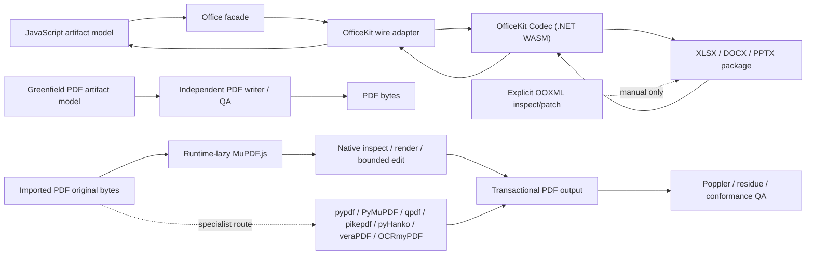

# Runtime architecture

## Decision

OfficeKit Codec is the only XLSX, DOCX, and PPTX codec. It is implemented in C# with the Open XML SDK and compiled into the bundled .NET WebAssembly runtime. PDF remains an independent implementation.

OfficeKit retains the single-codec boundary: no Office codec registry,
selector, alternate runtime shim, or fallback path.



## Responsibilities

### JavaScript

JavaScript owns:

- public Workbook, DocumentModel, Presentation, and PDF object models;
- formula calculation and other model-side computation;
- presentation Compose/JSX;
- validation, normalization, inspect, resolve, layout, render orchestration, and QA;
- the OfficeKit wire adapter and generated protocol binding;
- explicit, low-level OOXML package inspect/patch helpers;
- JSZip where package inspection/patching needs it;
- the independent PDF pipeline and optional adapters.

JavaScript does not serialize or parse DOCX, XLSX, or PPTX for the normal file facades.

### OfficeKit Codec

OfficeKit owns:

- OPC package validation and safe path/relationship/content-type handling;
- DOCX, XLSX, and PPTX semantic import/export;
- source snapshot and opaque-object preservation checks;
- bounded source-bound edits;
- deterministic package generation within the supported profiles.

The implementation uses the Open XML SDK because its strongly typed package and schema model provides a broad, shared foundation across WordprocessingML, SpreadsheetML, and PresentationML. C# is not exposed as a second user model; the wire is the boundary between JavaScript artifacts and native OOXML operations.

### PDF

PDF never enters the Office codec request, has no Office protobuf payload, and does not load the C# runtime. The project does not create `OfficeKit.Pdf` or maintain a general C# PDF parser/writer.

The JavaScript `PdfArtifact`/`PdfFile` domain owns greenfield semantic/tagged authoring, trusted-model roundtrip, reading order, accessibility metadata, inspect/verify, and modeled render QA. The required `mupdf@1.28.0` dependency is loaded only when a PDF operation needs it; arbitrary PDFs use MuPDF.js by default for native parsing, structured-text/image/link evidence, inspection, raster rendering, and bounded direct-original edits. PDF.js remains an optional reconstructed read/inspect adapter, never an edit representation.

The native PDF Skill calls the same `PdfFile` MuPDF.js primitives through a thin JavaScript CLI. `office-kit/pdf/providers` is a separate, lightweight control plane: it imports a versioned catalog and project policy but does not load MuPDF, download, or write a cache. It resolves exactly one selected task/provider to `ready`, `installable`, or `blocked`; a missing `.office-kit/pdf-providers.json` means download-disabled. Under explicit managed policy it may install only catalog-declared, versioned, hash-pinned release assets into a project-private cache using locks, bounded temporary downloads, safe extraction, receipts, and atomic publication. A `system-only` deployment remains possible, but neither route silently changes to the other. The current catalog publishes and attests qpdf `12.3.2-oat.2`, `python-foundation` `3.13.14-oat.2`, `python-specialists` `3.13.14-oat.2`, veraPDF/JRE `1.30.2-oat.2`, OCR core `17.8.1-oat.3`, and `eng`/`chi_sim` language packs `4.1.0-oat.3` for `darwin-arm64`, `linux-x64`, and `win32-x64`; public live acceptance verifies resolve, ensure, probe, and asset attestations for every published closure. The foundation contains isolated CPython, ReportLab, pdfplumber, pypdf, and Pillow. Specialists contain PyMuPDF, pikepdf, pyHanko, and certificate validation, depend on qpdf, and require an AGPL-or-commercial acknowledgement. The veraPDF pack brings a managed JRE, so probe/validation has no global Java dependency. OCR installs its qpdf/core/language closure only after policy authorization; the core contains isolated OCRmyPDF, Tesseract 5, Ghostscript, and `pdftotext`, and language packs are selected explicitly. Only Poppler QA remains intentionally unpublished and therefore blocks rather than substituting an unverified download.

OfficeKit 0.6.0 also has a distribution boundary above the runtime graph. The
`darwin-arm64`, `linux-x64`, and `win32-x64` standalone archives carry an
official SHA-256-pinned Node 24.18.0 executable plus the same OfficeKit payload
and production dependency closure. `bin/officekit` or `bin/officekit.cmd`
always invokes that co-located runtime. The POSIX or PowerShell installer stages
one complete version, probes its CLI, publishes it below a versioned user
directory, then atomically changes the active version. OfficeKit Codec and
MuPDF remain lazy within that installed process; `init`, `update`, and template
retrieval stay on the lightweight CLI path.
Provider-managed qpdf, Python, OCR, veraPDF/JRE, LibreOffice, and Poppler
continue to live outside this base archive and retain their existing project
policy, cache, receipt, and task-selection contracts.

Python and system adapters remain the explicit routes for strict scrub/residue, typed pypdf workflows, qpdf repair/linearization, pikepdf fixed-profile structure cleanup, veraPDF conformance, and OCRmyPDF searchable-layer generation. Two pyHanko boundaries are shipped over one selected runtime: `pyhanko_sign_provider.py` inventories a private exact-source snapshot and adds one local-PKCS#12 approval or first-document certification signature under explicit field, count, credential, DocMDP, byte/time/output, trust/isolation, exact-prefix, and no-replace constraints; `pyhanko_provider.py` independently validates immutable final bytes under caller-supplied roots and reports integrity, trust, revision coverage, difference level, timestamps, DocMDP, FieldMDP, and policy gates. The runtime can be managed, but P12/private keys, HSM/remote-signing credentials, TSA/LTV access, and trust roots are never installable. Passphrases enter only on stdin, signing never establishes certificate trust, and complete PAdES conformance remains external. Poppler remains independent final render QA.

The router has no silent fallback. Mutation records source hashes and uses a distinct transactional output plus one explicit strategy: `rewrite`, byte-prefix-preserving `incremental`, or destructive `sanitize`. Signature/DocMDP evidence is checked first. High-trust redaction applies real redactions, scrubs, fully rewrites, scans raw/decoded/metadata/attachment/annotation/OCR residue and old revisions, then requires Poppler review.

The project and official MuPDF.js dependency are GNU AGPL-3.0-or-later. Normal npm installation resolves MuPDF.js as a required direct dependency; it remains in its own dependency tarball and is not copied into this project's `.tgz`. Capability-pack binaries, Python wheels, OCR language data, JREs, and qpdf are never bundled into the npm tarball. No lifecycle hook or standalone dependency installer is used.

### Excel Live Control

Excel Live Control is a local host adapter, not an XLSX codec and not a cloud
connector. `officekit excel install` generates a per-user root certificate,
localhost leaf certificate, add-in-only Excel XML manifest, and a fixed-port
loopback HTTPS bridge. The user sideloads the manifest and clicks the OfficeKit
Home-ribbon command in the workbook they intend to expose. The Add-in uses the
Office.js CDN plus a long shared runtime; browser pairing is a Secure,
HttpOnly, SameSite cookie and CLI requests use a separate private secret with
the saved localhost leaf fingerprint pinned on every request.

The bridge is launched by `install`, `doctor`, `sessions`, or `execute` and
exits after an idle grace period with no live workbook. It has no login item,
daemon registration, account, tenant, relay, or arbitrary Office.js execution
endpoint. Protocol 1 carries schema-validated typed operations only; each is
capability-checked in the Add-in, serialized per session, bounded in payload,
idempotent by caller key, and followed by an audit record that excludes cell
contents and formulas. Explicit `save` leaves the file path and overwrite
choice to Excel and the user. V1 is limited to Microsoft Excel desktop on
Windows and macOS; browser/mobile Excel, VBA/COM, and enterprise deployment
are outside this adapter.

### Skill routing

OfficeKit is a project-native coordination Skill, not another artifact model or
codec. It assigns exactly one owning domain Skill to each output, orders
cross-format work as a dependency graph, and loads only the selected installed
Skills. Its template query reads bounded schema-v2 metadata and verifies safe
paths plus retained-asset hashes; it does not import Office files, render all
previews, execute catalog text, or select a template by itself. Template
selection has three valid results: one selected template, a short user choice,
or no template. The domain Skill remains responsible for editing, source
preservation, render QA, and fail-closed behavior.

Before querying, OfficeKit classifies task state along two axes: whether the
artifact goal is clear and whether a template is already specified. Only a
clear goal with no selected template enters the local field-weighted BM25F
index. An unclear goal is clarified first; an uploaded or named template skips
catalog search and is inspected through the owning domain Skill. Uploaded
Office files are task-scoped references unless the user explicitly routes them
to Template Creator for reusable local registration. BM25F returns ranking and
match/conflict evidence with `selectionMade: false`; semantic and visual choice
remains with the Agent, without a vector database or embedded model call.

## Facade contract

The six Office methods are:

- `SpreadsheetFile.importXlsx(input, { limits? })`
- `SpreadsheetFile.exportXlsx(workbook, { limits?, recalculate? })`
- `DocumentFile.importDocx(input, { limits? })`
- `DocumentFile.exportDocx(document, { limits? })`
- `PresentationFile.importPptx(input, { limits? })`
- `PresentationFile.exportPptx(presentation, { limits? })`

Each method dynamically imports the OfficeKit codec leaf, then invokes the corresponding typed helper. This avoids the model/adapter static-import cycle while keeping one runtime identity.

Passing `codec`, `allowLossy`, `preferNative`, `relativeDateAsOf`, or any other unknown option throws before codec execution. A missing or invalid WASM runtime also throws; no alternate implementation is tried.

`office-kit/codec` is the sole public advanced codec boundary, and
`office-kit/codec/wire` exposes generated messages. The unreleased project does
not carry legacy codec subpaths or name-only compatibility bridges.

## Wire protocol 2

The namespace remains `office_kit.artifact.v1`. Protocol version 2 is intentionally breaking.

- `CodecRequest.allow_lossy` was removed.
- Its field name and number are reserved and cannot be reused.
- The request contains exactly one supported artifact payload for its declared operation.
- Office export responses report `metadata.codec: "office-kit"` at the JavaScript boundary.
- XLSX adds basic validation, conditional-format, and one-level threaded-comment records.
- XLSX worksheet protection uses one explicit enabled/removal record, an enum of agent-facing allowed operations, and a hash-bound source locator. OfficeKit contains SpreadsheetML's inverted operation locks and schema defaults. Only active passwordless profiles are semantic; password/hash/extension or disabled/partial profiles remain source-owned and fail closed on replacement.
- DOCX adds style/default formatting, paragraph/run formatting, a canonical solid paragraph-shading profile, and one bounded paragraph-border profile: a six-digit RGB `w:shd` fill with `clear`/`auto`, plus a nonempty subset of six named border sides with exact RGB color, eighth-point size, and point space. The codec owns canonical `w:shd` and `w:pBdr`/`single` serialization and recognition; JavaScript owns the small complete-replacement objects. Imported ordinary direct paragraphs can change only recognized profiles, while theme/pattern/frame/shadow/other border styles and imported style catalogs remain source-bound. DOCX also carries bounded block/inline plain-text content-control identity with explicit placement, section/header/footer, field, image, and passwordless document-protection records. An image may carry an independently versioned floating-placement record for bounded absolute margin/page/column or margin/page/paragraph positioning, square/top-and-bottom wrapping, wrap side, and text distances; absence means inline flow. OfficeKit owns the fixed safe anchor profile, while JavaScript owns the smaller public object. Imported inline/floating topology is immutable, and unrecognized anchors stay in the source-bound OPC graph. Password verifier/cryptographic variants likewise remain source-bound and cannot be replaced through the semantic wire.
- `DocumentNote.paragraphs` is additive field 7: it carries a canonical 1-through-16 physical plain-text note body, while `text` is its LF-joined display projection. An absent `paragraphs` field retains the protocol-2 one-string authoring shape. A recognized imported note binds its exact paragraph count, native ID, anchor, and formatting/source evidence; only same-count text replacement crosses the semantic wire.
- DOCX picture bullets add one independent semantic marker record to numbering-level data: an embedded asset ID or external HTTP(S) URI, bounded EMU geometry, and alternative text. Package relationship IDs, part paths, and native `numPicBulletId` values never cross the public wire. The C# codec owns the canonical VML relationship graph, shared-resource allocation, recognized import profile, and instance-local source-edit override; the JavaScript adapter owns data-URL validation, content-addressed asset IDs, public point units, and complete same-level coherence checks.
- PPTX adds connector, chart, and basic shadow records.

New fields are added only when the existing public artifact model and wire cannot express an accepted 0.2 capability. The project does not maintain a parallel native object model.

## Opaque preservation and fail-closed edits

On import, OfficeKit can attach:

- a bounded source package snapshot;
- normalized part paths and resolved content types;
- per-part and package hashes;
- relationship metadata;
- recognized editable-source bindings;
- a versioned `PresentationOleOfficePackage` binding only for accepted
  top-level OLE Office-package profiles; current writer support is DOCX and
  carries kind, part path, MIME type, relationship ID, source SHA-256, and an
  optional replacement asset ID rather than a generic OLE container;
- opaque element/part evidence.

On export, recognized modeled edits are validated against their binding. Unmodeled content can be copied from the validated source package only while its evidence remains trustworthy. A topology-changing or unsupported semantic edit throws. If opaque content exists without a valid source snapshot, export throws. There is no opt-out switch.

Explicit OOXML inspect/patch functions are a separate low-level operation. They do not count as a fallback because the user must call them directly and the facade never routes through them.

## Runtime loading and package layout

The adapter initializes one retry-safe cached WASM runtime. It checks the bundled manifest, protocol version, assembly identity, and runtime assets before invoking the codec.

The source repository contains:

- `native/OfficeKit` C# projects and tests;
- the public proto and generation config;
- runtime build/reproducibility scripts;
- JavaScript adapters, models, Skills, and tests.

The npm package contains:

- public JavaScript APIs and adapters;
- the proto and generated JavaScript wire binding;
- `runtime/office-kit` WASM/runtime assets;
- integrity manifest, SBOM, and license notices;
- the optional `native/OfficeBridge/src` project, without its repository-only solution or tests;
- seven npm-distributed native plugin bundles: six provide the seven initialized
  workflow Skills (the four file-type routes, `excel-live-control`, the
  `office-kit` coordinator, and `template-creator`); the seventh is the
  MIT-licensed `default-template-library` with twenty retained
  DOCX/PPTX/XLSX template Skills. The installed OfficeKit runtime keeps the
  template assets in one place, and `officekit init` does not copy them into
  projects.

It excludes OfficeKit C# source, every C# test and solution, all C# build output, repository-only scripts/tests, and removed legacy codec modules. Normal package use therefore works without a local .NET SDK; only consumers who explicitly build the optional OfficeBridge helper need one.

## JavaScript source-module discipline

`src/index.mjs` remains the package composition root and compatibility barrel. Splitting it must not change the root export names, constructor identities, package subpaths, or facade behavior.

The target dependency direction is intentionally one-way:

```text
shared binary / FileBlob / inspection / image / render primitives
  -> Help, presentation Compose, and PDF domain
  -> Office format models and shared OOXML package tools
  -> root compatibility barrel
```

New leaf modules must not import the root entry. The root re-exports the original binding instead of wrapping or copying classes and functions, so `instanceof` and strict identity checks remain stable. Renderer, native-bridge, JSX, and the Document-side OfficeKit adapter now import their leaf dependencies directly. The remaining OfficeKit adapters still temporarily import root model bindings; that dependency will be removed only after the corresponding Spreadsheet and Presentation models move as atomic clusters. Office facade methods retain dynamic OfficeKit imports to avoid eager model/adapter cycles.

The first extraction phase moved Help, presentation Compose, binary conversion, `FileBlob`, inspection, and text-range primitives out of the root. The shared text-range primitive is consumed by both Presentation and Document resolve/inspect paths instead of being hidden inside either domain. The PDF phase then moved the complete PDF model, writer/parser facade, SVG preview, and tagged-file serializer as one domain cluster; the root re-exports the exact `PdfArtifact` and `PdfFile` bindings. Cross-format IDs still come from one shared allocator, while image, PNG, XML, and render-output primitives are dependency leaves used by multiple domains.

The shared OOXML package phase moved JSZip loading, decompression limits, safe part paths, content types, relationships, part recipes, source-reference synchronization, validation, and transactional generation into `src/ooxml/package.mjs`. That module has four internal exports and does not import the root. The Document phase then moved styles, blocks, bookmarks, comments, layout, inspect/resolve/verify/render, DOCX package policy, and `DocumentFile` together into `src/document/index.mjs`; the root re-exports the exact `DocumentModel` and `DocumentFile` bindings. Spreadsheet and Presentation stateful models remain future atomic clusters. Each phase is behavior-preserving: public binding identity, root export names, facade behavior, package security failures, and packed contents are regression-tested before further decomposition.

## Verification layers

1. Protocol generation/lint and protocol-version checks.
2. C# unit tests for each codec and opaque/failure profiles.
3. JavaScript facade roundtrips and strict option rejection.
4. Native plugin validation plus audited Documents, Spreadsheets, Excel live-control bridge/mock-Office.js, Presentations, and PDF Skill workflows.
5. Semantic inspect/verify and render/visual QA.
6. Open XML SDK package validation plus optional LibreOffice/native Office checks.
7. Clean-install probes with `dotnet` absent from `PATH`.
8. Deterministic WASM rebuild, package-content, SBOM, release, and hosted Linux gates.
